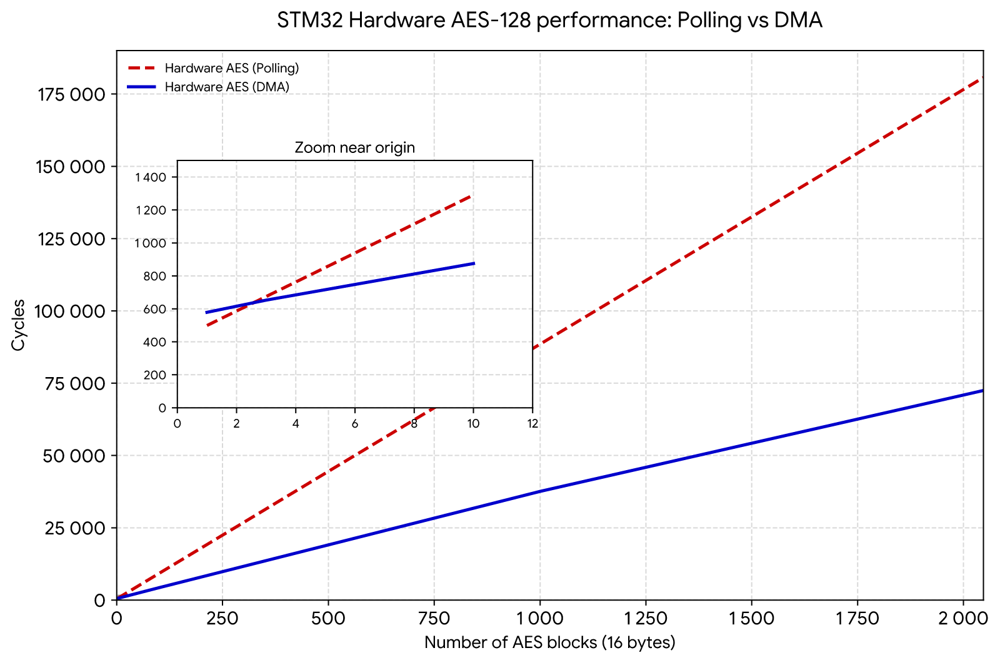
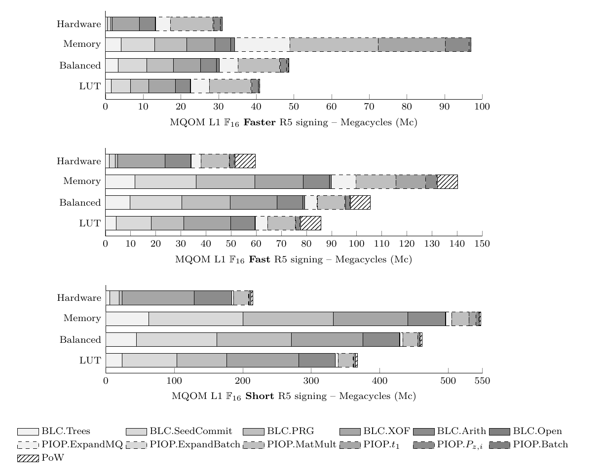

# Experiments with embedded MQOM

The current repository contains experimental code for the [MQOM](https://mqom.org/) NIST PQ round 2 on-ramp signature candidate.
This code is a companion to the article **"Breaking the Myth of MPCitH Inefficiency: Optimizing MQOM for Embedded Platforms"** that
details all the optimization strategies included here. The code provided here contains patches of the [upstream MQOM code](https://github.com/mqom/mqom-v2)
in its version 2.1 (the last specification update at the time of writing the article).

The source code is mostly split in four parts:
- A main firmware source code in the [embedded_CM4](embedded_CM4) folder. This code is based on [libopencm3](https://libopencm3.org/) to provide
a minimalist standalone firmware for Cortex-M4 based platforms (see below for the detail of the supported boards). The outstanding code in this firmware
concerns the benchmarking part, with cycles measurement, stack usage measurement using spraying techniques, and static data (e.g. global tables) measurement
using dedicated ELF sections and `ld` scripts tricks.
- Source code for the original MQOM optimizations in the [mqom_base](mqom_base) folder.
- Source code for the one-tree tweak of MQOM in the [mqom_onetree](mqom_onetree) folder.
- Source code for the streaming verification and pre-signature tweaks in the [mqom_verifstream_presign](mqom_verifstream_presign) folder.

The main compilation of the various testing firmwares is performed using a centralized [Makefile](Makefile) at the root folder of the project.
We explain hereafter the various command lines to use for each test to reproduce the results of the article.

## Table of Content
- [Target platforms and required software](#target-platforms-and-required-software)
  - [Target platforms](#target-platforms)
  - [Easy setup with Docker](#easy-setup-with-docker)
  - [Compiling](#compiling)
  - [Flashing](#flashing)
  - [UART console communication](#uart-console-communication)
  - [About portability of the code across platforms](#about-portability-of-the-code-across-platforms)
  - [Porting to other Cortex-M boards](#porting-to-other-cortex-m-boards)
  - [Using upstream MQOM repo](#using-upstream-mqom-repo)
- [Rijndael tests](#rijndael-tests)
- [Matrix Multiplication tests](#matrix-multiplication-tests)
- [MQOM base optimizations](#mqom-base-optimizations)
  - [LUT profile](#lut-profile)
  - [Balanced profile](#balanced-profile)
  - [Memory profile](#memory-profile)
  - [Hardware profile](#hardware-profile)
  - [L3 and L5 benchmarks](#l3-and-l5-benchmarks)
  - [Reference MQOM implementation benchmarks](#reference-mqom-implementation-benchmarks)
  - [Detailed benchmarks](#detailed-benchmarks)
  - [Checking the KATs](#checking-the-kats)
  - [Using signature buffer as temporary buffer](#using-signature-buffer-as-temporary-buffer)
- [MQOM one-tree experiments](#mqom-one-tree-experiments)
- [MQOM verification streaming experiments](#mqom-verification-streaming-experiments)
- [MQOM pre-signature experiments](#mqom-pre-signature-experiments)


## Target platforms and required software

### Target platforms

There are two main platforms targeted here for the article:
- The STMicroeletronics [Nucleo L4R5ZI](https://www.st.com/en/evaluation-tools/nucleo-l4r5zi.html) featuring a [STM32L4R5ZI](https://www.st.com/en/microcontrollers-microprocessors/stm32l4r5-s5.html)
MCU with 2 MB of flash and 640 KB of SRAM.
- A custom board that integrates a [STM32F437](https://www.st.com/en/microcontrollers-microprocessors/stm32f427-437.html) MCU with 2 MB of flash and 256 KB of SRAM, also embedding a CRYP engine with AES hardware acceleration. The current implementation uses a [LEIA board by H2LAB](https://h2lab.github.io/smartleia.github.io/target.html).

We also support the STMicroeletronics [STM32F4DISCOVERY](https://www.st.com/en/evaluation-tools/stm32f4discovery.html) board that features a [STM32F407](https://www.st.com/en/microcontrollers-microprocessors/stm32f407-417.html) MCU with
1 MB of flash and 192 KB of SRAM. Regarding the custom LEIA board with the AES accelerator, if you have a different board with a STM32F437 check the [Porting to other Cortex-M boards](#porting-to-other-cortex-m-boards) paragraph for insights
on how to adapt the code.

### Easy setup with Docker

We provide in the [Docker](Docker) folder a `Dockerfile` that embeds the ARM toolchain used for the benchmarks. You must obviously have `docker` installed to use it.
The purpose of this file is to drop a "dev shell" with all the tool installed so that you can execute compilation (and flashing depending on the host, see below).
The `Makefile` has two dedicated targets: `make dev-shell` and `make dev-shell-usb`.

When running `make dev-shell`, you should be greeted with a shell like this:

```console
devuser@ccf10d67c871:/home/app#
```

where you can run the commands presented in the current repository.

With `make dev-shell-usb`, `docker` will share the USB connection with the development board(s) connected to USB: **beware that this launches Docker in a privileged mode to share USB, use it at your own
risks**. This allows to flash the boards directly from within the container. Beware that this is only compatible with **Linux hosts** because of the way USB sharing is handled.

```console
make dev-shell-usb 
Checking host OS compatibility wit USB sharing...
WARNING: to share USB, docker will run with '--privileged', use at your own risks.
Do you still want to continue? [y/N] y
Building Docker image...
[+] Building 0.4s (10/10) FINISHED                                                                                                                                                                                                             docker:default
...
Launching dev environment with USB support
devuser@67d37673fd15:/home/app# 
```

**NOTE:** The container drops you a shell with the uid/gid of your user to keep the proper rights on your files. However, depending on your host rights with `/dev/bus/usb`, you might need
to perform the flashing as `root`. If you encounter a "permission denied" when trying to flash, launch the command again with `sudo` in the container.

### Compiling

The source code can be compiled for either of the three boards using compilation toggles: `BOARD=nucleol4r5zi` for the Nucleo L4R5ZI board, `BOARD=leia` for the custom STM32F437 board,
`BOARD=stm32discovery` for the STM32F4DISCOVERY board. By default, the `Makefile` will compile for the Nucleo L4R5ZI board when no `BOARD` is specified.
The result of the compilation are two files in the [embedded_CM4/](embedded_CM4/) folder: a `main.elf` ELF file and a `main.bin` file that represents the flat raw binary firmware that is flashed through ST-Link.
You can use the ELF file for loading the debugging symbols during your `gdb` sessions if needed.

All the results and benchmarks in the article have been obtained with the `arm-none-eabi-gcc` toolchain **from Debian Trixie in version 14.2.1**:

```console
$ arm-none-eabi-gcc -v
Using built-in specs.
COLLECT_GCC=arm-none-eabi-gcc
COLLECT_LTO_WRAPPER=/usr/lib/gcc/arm-none-eabi/14.2.1/lto-wrapper
Target: arm-none-eabi
...
Thread model: single
Supported LTO compression algorithms: zlib
gcc version 14.2.1 20241119 (15:14.2.rel1-1) 
```

### Flashing

In order to flash the firmware, you will have to use the [st-flash](https://github.com/stlink-org/stlink) tool that should be packaged in most Linux distros (e.g. `stlink-tools` package in
Debian). When the tool is installed, choose your board and execute the flashing command (here `xxx` is the chosen board):

```console
BOARD=xxx make flash
```

A flasher with a [ST-Link chip](https://www.st.com/en/development-tools/st-link-v2.html) that programs the board is of course expected to be plugged in on your PC USB port to perform this (many
boards such as the Nucleo L4R5ZI or the STM32F4DISCOVERY also contain such chips and can be transformed into flashers for other boards, for the LEIA board you will have to use such an external programmer or adapt
the flashing method to use the specific DFU mode).


### UART console communication

When the firmware is flashed, communication is done using the UART protocol with a 38400 baud rate:

- For the Nucleo L4R5ZI, the embedded serial port is used, usually showing up as `/dev/ttyACMx` (with `x` a number) in Linux hosts. 
- For the custom LEIA board, the UART used is `USART1` on the GPIOs `PB6` and `PB7` (see [embedded_CM4/src/hal/hal.h](embedded_CM4/src/hal/hal.h)). You will have to plug a dedicated
TTY serial converter to those pins and to your PC to get the serial console.
- For the STM32F4DISCOVERY board, the UART used is `USART2` on the GPIOs `PA2` and `PA3` (see [embedded_CM4/src/hal/hal.h](embedded_CM4/src/hal/hal.h)). You will have to plug a dedicated
TTY serial converter to those pins and to your PC to get the serial console.

### About portability of the code across platforms

As described in the article, most of the code is in **portable C**, except for two parts that use **assembly** for the ARMVv7-M architecture:

- SHA-3/SHAKE: the assembly files are in [sha3/armv7m/](mqom_base/sha3/armv7m/).
- AES-128 (for MQOM security level L1): the assembly files are [rijndael/aes128_fixsliced_arvmv7m.s](mqom_base/rijndael/aes128_fixsliced_arvmv7m.s) for the "fixsliced" (bitslice) constant-time version,
and [rijndael/aes128_table_arvmv7m.s](mqom_base/rijndael/aes128_table_arvmv7m.s) for the table-based version (constant time only when tables are in SRAM, and SRAM access is constant time on
the target platform).

However, one can always switch to **pure C** variants for the previous components. In order to do so:
- Force the SHA-3 library to use C with the explicit compilation toggles `KECCAK_PLATFORM=plain32` or `KECCAK_PLATFORM=opt64` (`plain32` is a 32 bits variant, while `opt64` uses `uint64_t`: depending on your
target architecture, one can be more performant than the other).
- Remove the `RIJNDAEL_OPT_ARMV7M=1` (or set it to `0`) in all the following compilation command lines to backup to the C variant of AES-128.

Hence, with the `KECCAK_PLATFORM=plain32 RIJNDAEL_OPT_ARMV7M=0` or `KECCAK_PLATFORM=opt64 RIJNDAEL_OPT_ARMV7M=0` compilation toggles, you should end up with a pure C portable code that should
execute on any (embedded or not) platform (ARM, RISC-V, x86, etc.). Of course, **you will have to adapt the compiler and the linking part yourself** so that the toolchain produces a binary/firmware suitable
for your platform/MCU/board. You can override the toolchain parameters by overloading `CROSS_CC`, `CROSS_AR` abd `CROSS_RANLIB` as well as the `CFLAGS` and `LDFLAGS` for the MQOM objects compilation.
The elements in the [embedded_CM4/](embedded_CM4/) are of course more "rigid" as they are closely related to Cortex-M and the [libopencm3](https://libopencm3.org/) stuff (see [Porting to other Cortex-M boards](#porting-to-other-cortex-m-boards)).

As a matter of fact, this portability allows for testing the soundness of the various generic optimizations of MQOM on x86 or ARM desktops. For instance, if you want to locally test
the [LUT profile](#lut-profile), you can extract the `MQOM2_OPTIONS` and compile the MQOM `bench` binary in the [mqom_base/](mqom_base/) folder (observe the `bench` target instead of the `firmware` target as we
use the original MQOM compilation toolchain, and here the local `gcc` is used):
```console
# Local compilation in the mqom_base folder
cd mqom_base && make clean && MQOM2_VARIANT=cat1-gf16-faster-r5 USE_PRG_CACHE=1 USE_PIOP_CACHE=0 MEMORY_EFFICIENT_PIOP=0 PIOP_BITSLICE=1 FIELDS_BITSLICE_COMPOSITE=1 FIELDS_BITSLICE_PUBLIC_JUMP=1 MEMORY_EFFICIENT_BLC=1 MEMORY_EFFICIENT_KEYGEN=1 RIJNDAEL_OPT_ARMV7M=0 KECCAK_PLATFORM=plain32  USE_GF256_TABLE_LOG_EXP=1 RIJNDAEL_BITSLICE=0 RIJNDAEL_TABLE=1 RIJNDAEL_EXTERNAL=0 USE_ENC_CTX_CLEANSING=0 USE_ENC_X8=0 USE_XOF_X4=0 BLC_INTERNAL_X2=1 GGMTREE_NB_ENC_CTX_IN_MEMORY=3 BENCHMARK=0 VERIFY_MEMOPT=0 NO_EXPANDMQ_PRG_CACHE=1 PRG_ONE_RIJNDAEL_CTX=0 SEED_COMMIT_MEMOPT=0 RIJNDAEL_TABLE_FORCE_IN_FLASH=0 USE_SIGNATURE_BUFFER_AS_TEMP=0 make bench

# In the mqom_base folder, execute the bench
./bench
```

### Porting to other Cortex-M boards

Since we use [libopencm3](https://libopencm3.org/) as the foundation of our firmware code, and since our MQOM code is in portable C (note that our assembly is compatible with Cortex-M3/M4/M7, but not with Cortex-M0 where the C variant of the code must be used), one should be able to port the firmware to any board with a MCU supported by this library. The list of these target MCUs is reported in the [README](embedded_CM4/libopencm3/README.md) in the folder dedicated to the library.

When considering porting to a new MCU/board combo, the main files to modify are in the Hardware Abstraction Layer folder [embedded_CM4/src/hal/](embedded_CM4/src/hal/) as well as the linker scripts in [embedded_CM4/boards/](embedded_CM4/boards/).
You will have to adapt depending on the MCU various initialization procedures such as the `clock_setup` that initializes the clocks, the UART setup and wiring to the proper GPIO pins of your board, etc.

### Using upstream MQOM repo

The current repository uses fixed MQOM code in the [mqom_base](mqom_base), [mqom_onetree](mqom_onetree) and [mqom_verifstream_presign](mqom_verifstream_presign) folders.
It is possible to use the [upstream MQOM code](https://github.com/mqom/mqom-v2) by forcing the `UPSTREAM=1` variable when compiling in place of one of
`ONETREE_TEST=1`, `PRESIGN_TEST=1` and `VERIFY_STREAM_TEST=1` (you can also tweak the [Makefile](Makefile) to point to another repository). Using the upstream code will allow
you to test new upstream feature in the embedded context.

In order to use the upstream code, you will first have to fetch it by using :

```console
$ make clean && BOARD=nucleol4r5zi UPSTREAM=1 make
...
[-] The MQOM git folder is not present ... Please fetch it with 'make fetch_mqom_git'!
make: *** [Makefile:107: objects] Error 1

$ make fetch_mqom_git
[+] Fetching MQOM2 source tree from the git ...
...

# Then use all the compilation invocations presented below with UPSTREAM=1
```

**NOTE:** Beware that using the upstream code might break the embedded compilation depending on the included features and your options for MQOM.
Use `UPSTREAM=1` it knowingly.

## Rijndael tests

In order to reproduce the three main columns of **Table 1** from the article that summarizes the AES-128 and Rijndael-256-256 performance for bitslice/table-based/hardware Rijndael, use the following compilation toggles:

- For the bitslice version:
```console
make clean && BOARD=nucleol4r5zi RIJNDAEL_OPT_ARMV7M=1 RIJNDAEL_BITSLICE=1 RIJNDAEL_TEST=1 make firmware
```

- For the table-based version:
```console
make clean && BOARD=nucleol4r5zi RIJNDAEL_OPT_ARMV7M=1 RIJNDAEL_TEST=1 RIJNDAEL_TABLE=1 make firmware
```

- For the hardware-based version, **only on the custom STM32F437** based board (note the `-DNO_AES256_TESTS -DNO_RIJNDAEL256_TESTS` extra CFLAGS since we only want to test
AES-128 in this case):
```console
make clean && BOARD=leia RIJNDAEL_OPT_ARMV7M=1 RIJNDAEL_TEST=1 RIJNDAEL_EXTERNAL=1 EXTRA_CFLAGS="-DNO_AES256_TESTS -DNO_RIJNDAEL256_TESTS" make firmware 
```

**NOTE:** The private/public encryption APIs and the `x2`, `x4`, `x8` APIs described in the article are exposed in the [rijndael/rijndael.h](mqom_base/rijndael/rijndael.h) header.

### AES and Rijndael performance summary

The resulting benchmarks should be the following:

| Scheme            | Variant          | Bitslice KeySch. | Bitslice Enc. | Table-based KeySch. | Table-based Enc. | Hardware KeySch. + Enc. |
|------------------|------------------|------------------|---------------|---------------------|------------------|--------------------------|
| AES-128          | `x1`             | 405              | 4 910         | 405                 | 800              | 529                      |
| AES-128          | `x2`             | 810              | 5 056         | 810                 | 1 500            | 909                      |
| AES-128          | `x2` amortized   | 2 751            | 2 879         | -                   | -                | -                        |
| AES-128          | `x4`             | 1 620            | 10 037        | 1 620               | 2 900            | 1 661                    |
| AES-128          | `x4` amortized   | 5 405            | 5 660         | -                   | -                | -                        |
| Rijndael-256-256 | `x1`             | 1 398            | 21 121        | 1 300               | 3 345            | N/A                      |
| Rijndael-256-256 | `x2`             | 2 800            | 23 043        | 2 500               | 6 600            | N/A                      |
| Rijndael-256-256 | `x2` amortized   | 12 224           | 15 695        | -                   | -                | N/A                      |
| Rijndael-256-256 | `x4`             | 5 600            | 46 488        | 5 334               | 14 000           | N/A                      |
| Rijndael-256-256 | `x4` amortized   | 24 624           | 32 024        | -                   | -                | N/A                      |

### Hardware acceleration Polling versus DMA

The compilation of the hardware-based versions should also output a set of measurements to compare AES-128 hardware Polling versus DMA drivers.
For each type (Polling and DMA), each number at position `i` (between 1 and 2047) is the cycles taken by the encryption of `i` sequential blocks of 16 bytes.

```console
 ==== Hardware AES polling versus DMA benchmarks =====
==== POLLING
499 587 675 763 851 939 1027 1115 1203 1291 1379 ... 180704
==== DMA
579 616 653 690 727 764 800 801 838 942 912 949 ... 72469
======================
```

Plotting these number provides Figure 3 of the article:



## Matrix Multiplication tests

In order to reproduce the **Table 3** from the article, summarizing the matrix multiplication performance for various strategies, use the following compilation toggles
(**NOTE:** we use `MQOM2_OPTIONS="MQOM2_VARIANT=cat1-gf16-fast-r5"` for the L1 security level, use `MQOM2_OPTIONS="MQOM2_VARIANT=cat3-gf16-fast-r5"` for the L3 level, and
`MQOM2_OPTIONS="MQOM2_VARIANT=cat5-gf16-fast-r5"` for the L5 level):

- For the F256 SWAR 32 bits L1 matrix multiplication against the 4 bitslice variants, use the following:
```console
make clean && BOARD=nucleol4r5zi MQOM2_OPTIONS="MQOM2_VARIANT=cat1-gf16-fast-r5" BENCHMARK=1 MAT_MULT_TEST=1 make firmware 
```


- For the F256 log/exp table L1 matrix multiplication against the 4 bitslice variants, use the following:
```console
make clean && BOARD=nucleol4r5zi MQOM2_OPTIONS="MQOM2_VARIANT=cat1-gf16-fast-r5" USE_GF256_TABLE_LOG_EXP=1 BENCHMARK=1 MAT_MULT_TEST=1 make firmware 
```

- For the F256 full 65 KB table L1 matrix multiplication against the 4 bitslice variants, use the following:
```console
make clean && BOARD=nucleol4r5zi MQOM2_OPTIONS="MQOM2_VARIANT=cat1-gf16-fast-r5" USE_GF256_TABLE_MULT=1 GF256_MULT_TABLE_SRAM=1 BENCHMARK=1 MAT_MULT_TEST=1 make firmware
```

- For the "basic circuit" base implementation against the 4 bitslice variants, use the following:
```console
make clean && BOARD=nucleol4r5zi MQOM2_OPTIONS="MQOM2_VARIANT=cat1-gf16-fast-r5" NO_FIELDS_REF_SWAR_OPT=1 BENCHMARK=1 MAT_MULT_TEST=1 make firmware
```

The resulting benchmarks should be the following:

| Implementation                          | F16 Fast L1 (n=56 / m̂=28, τ=17) | F16 Fast L3 (n=84 / m̂=42, τ=27) | F16 Fast L5 (n=116 / m̂=58, τ=36) |
|----------------------------------------|----------------------------------|----------------------------------|-----------------------------------|
| F256 Log/Exp tables ★                  | 15.3                             | 80.3                             | 277                               |
| Full F256 mult table †                 | 10.7                             | 51.3                             | 176                               |
| Basic circuit                          | 64.2                             | 348                              | 1213                              |
| SWAR 32 bits                           | 21.3                             | 104                              | 353                               |
| Bitslice                               | 20.0 (0.1)                       | 66.1 (0.3)                       | 338 (0.5)                         |
| Bitslice with jump                     | 11.9 (0.1)                       | 39.2 (0.3)                       | 199 (0.5)                         |
| Bitslice composite                     | 15.8 (0.1)                       | 52.2 (0.3)                       | 278 (0.5)                         |
| Bitslice composite with jump           | **9.9** (0.1)                    | **32.3** (0.3)                   | **160** (0.5)                     |

★ Log/Exp tables use ≈ 512 bytes in SRAM  
† Full F256 multiplication table uses ≈ 65 KB in SRAM


## MQOM base optimizations

We provide hereafter the compilation configurations for the four profiles (LUT, Balanced, Memory and Hardware) of security level L1 in **Table 4** of the article.

### LUT profile

For the Faster instance, compile with:
```console
make clean && BOARD=nucleol4r5zi MQOM2_OPTIONS="MQOM2_VARIANT=cat1-gf16-faster-r5 USE_PRG_CACHE=1 USE_PIOP_CACHE=0 MEMORY_EFFICIENT_PIOP=0 PIOP_BITSLICE=1 FIELDS_BITSLICE_COMPOSITE=1 FIELDS_BITSLICE_PUBLIC_JUMP=1 MEMORY_EFFICIENT_BLC=1 MEMORY_EFFICIENT_KEYGEN=1 RIJNDAEL_OPT_ARMV7M=1 USE_GF256_TABLE_LOG_EXP=1" RIJNDAEL_BITSLICE=0 RIJNDAEL_TABLE=1 RIJNDAEL_EXTERNAL=0 USE_ENC_CTX_CLEANSING=0 USE_ENC_X8=0 USE_XOF_X4=0 BLC_INTERNAL_X2=0 GGMTREE_NB_SIMULTANEOUS_LEAVES_LOG=5 BLC_NB_LEAF_SEEDS_IN_PARALLEL=32 BLC_SEEDCOMMIT_CACHE=1 BLC_SEEDEXPAND_CACHE=1 BENCHMARK=0 VERIFY_MEMOPT=0 NO_EXPANDMQ_PRG_CACHE=1 SEED_COMMIT_MEMOPT=0 SEED_COMMIT_MEMOPT=0 RIJNDAEL_TABLE_FORCE_IN_FLASH=0 USE_SIGNATURE_BUFFER_AS_TEMP=0 make firmware
```

For the Fast instance, replace `MQOM2_VARIANT=cat1-gf16-faster-r5` with `MQOM2_VARIANT=cat1-gf16-fast-r5`. For the Short instance, replace  `MQOM2_VARIANT=cat1-gf16-faster-r5` with `MQOM2_VARIANT=cat1-gf16-short-r5`.

The results should be the following:

| Scheme | Instance | Sig. size | Implem | KGen (Mc) | Sign (Mc) | Verify (Mc) | KGen (KB) | Sign (KB) | Verify (KB) |
|--------|----------|-----------|--------|-----------|-----------|-------------|-----------|-----------|-------------|
| MQOM (F16 R5) **This work** | Faster | 3 984 | LUT | 6.74★ | 29.2★ | 28.0 | 3.52★ | 12.0★ | 12.9 |
| MQOM (F16 R5) **This work** | Fast | 3 280 | LUT | 6.74★ | 52.8★ | 46.4 | 3.52★ | 10.5★ | 11.8 |
| MQOM (F16 R5) **This work** | Short | 2 916 | LUT | 5.99★ | 196★ | 194 | 3.65★ | 14.2★ | 17.7 |

★ Performance results rely on LUT use over secret entries.

### Balanced profile

For the Faster instance, compile with:
```console
make clean && BOARD=nucleol4r5zi MQOM2_OPTIONS="MQOM2_VARIANT=cat1-gf16-faster-r5 USE_PRG_CACHE=1 USE_PIOP_CACHE=0 MEMORY_EFFICIENT_PIOP=0 PIOP_BITSLICE=1 FIELDS_BITSLICE_COMPOSITE=1 FIELDS_BITSLICE_PUBLIC_JUMP=1 MEMORY_EFFICIENT_BLC=1 MEMORY_EFFICIENT_KEYGEN=1 RIJNDAEL_OPT_ARMV7M=1 USE_GF256_TABLE_LOG_EXP=0" RIJNDAEL_BITSLICE=1 RIJNDAEL_TABLE=0 RIJNDAEL_EXTERNAL=0 USE_ENC_CTX_CLEANSING=0 USE_ENC_X8=0 USE_XOF_X4=0 BLC_INTERNAL_X2=0 GGMTREE_NB_ENC_CTX_IN_MEMORY=0 NO_EXPANDMQ_PRG_CACHE=1 GGMTREE_NB_SIMULTANEOUS_LEAVES_LOG=5 BLC_NB_LEAF_SEEDS_IN_PARALLEL=32 BLC_SEEDCOMMIT_CACHE=1 BLC_SEEDEXPAND_CACHE=1 BENCHMARK=0 make firmware
```

For the Fast instance, replace `MQOM2_VARIANT=cat1-gf16-faster-r5` with `MQOM2_VARIANT=cat1-gf16-fast-r5`. For the Short instance, replace  `MQOM2_VARIANT=cat1-gf16-faster-r5` with `MQOM2_VARIANT=cat1-gf16-short-r5` and ̀`GGMTREE_NB_SIMULTANEOUS_LEAVES_LOG=5 BLC_NB_LEAF_SEEDS_IN_PARALLEL=32` with `GGMTREE_NB_SIMULTANEOUS_LEAVES_LOG=7 BLC_NB_LEAF_SEEDS_IN_PARALLEL=64`.

The results should be the following:

| Scheme | Instance | Sig. size | Implem | KGen (Mc) | Sign (Mc) | Verify (Mc) | KGen (KB) | Sign (KB) | Verify (KB) |
|--------|----------|-----------|--------|-----------|-----------|-------------|-----------|-----------|-------------|
| MQOM (F16 R5) **This work** | Faster | 3 984 | Bal. | 9.95 | 37.3 | 28.5 | 2.50 | 10.9 | 12.0 |
| MQOM (F16 R5) **This work** | Fast | 3 280 | Bal. | 9.95 | 73.2 | 47.0 | 2.50 | 9.50 | 10.7 |
| MQOM (F16 R5) **This work** | Short | 2 916 | Bal. | 9.23 | 291 | 194 | 2.65 | 13.5 | 16.8 |

### Memory profile

For the Faster instance, compile with:
```console
make clean && BOARD=nucleol4r5zi MQOM2_OPTIONS="MQOM2_VARIANT=cat1-gf16-faster-r5 USE_PRG_CACHE=0 USE_PIOP_CACHE=0 MEMORY_EFFICIENT_PIOP=1 PIOP_BITSLICE=0 FIELDS_BITSLICE_COMPOSITE=1 FIELDS_BITSLICE_PUBLIC_JUMP=1 MEMORY_EFFICIENT_BLC=1 MEMORY_EFFICIENT_KEYGEN=1 RIJNDAEL_OPT_ARMV7M=1 USE_GF256_TABLE_LOG_EXP=0" RIJNDAEL_BITSLICE=1 RIJNDAEL_TABLE=0 RIJNDAEL_EXTERNAL=0 USE_ENC_CTX_CLEANSING=0 USE_ENC_X8=0 USE_XOF_X4=0 BLC_INTERNAL_X2=0 GGMTREE_NB_ENC_CTX_IN_MEMORY=0 BENCHMARK=0 VERIFY_MEMOPT=1 NO_EXPANDMQ_PRG_CACHE=1 PRG_ONE_RIJNDAEL_CTX=1 SEED_COMMIT_MEMOPT=1 PIOP_NB_PARALLEL_REPETITIONS_SIGN=9 PIOP_NB_PARALLEL_REPETITIONS_VERIFY=4 RIJNDAEL_TABLE_FORCE_IN_FLASH=1 GGMTREE_NB_SIMULTANEOUS_LEAVES_LOG=4 BLC_NB_LEAF_SEEDS_IN_PARALLEL=8 make firmware
```

For the Fast instance, replace `MQOM2_VARIANT=cat1-gf16-faster-r5` with `MQOM2_VARIANT=cat1-gf16-fast-r5`. For the Short instance, replace  `MQOM2_VARIANT=cat1-gf16-faster-r5` with `MQOM2_VARIANT=cat1-gf16-short-r5`.

The results should be the following:

| Scheme | Instance | Sig. size | Implem | KGen (Mc) | Sign (Mc) | Verify (Mc) | KGen (KB) | Sign (KB) | Verify (KB) |
|--------|----------|-----------|--------|-----------|-----------|-------------|-----------|-----------|-------------|
| MQOM (F16 R5) **This work** | Faster | 3 984 | Mem. | 9.93 | 79.6 | 68.4 | 1.48 | 6.56 | 3.91 |
| MQOM (F16 R5) **This work** | Fast | 3 280 | Mem. | 9.93 | 102 | 70.9 | 1.48 | 5.76 | 3.91 |
| MQOM (F16 R5) **This work** | Short | 2 916 | Mem. | 9.21 | 366 | 212 | 1.62 | 6.00 | 4.24 |

### Hardware profile

**NOTE:** the Hardware profile is only available on the STM32F437 custom board with the AES hardware accelerator.

For the Faster instance, compile with:
```console
make clean && BOARD=leia MQOM2_OPTIONS="MQOM2_VARIANT=cat1-gf16-faster-r5 USE_PRG_CACHE=1 USE_PIOP_CACHE=0 MEMORY_EFFICIENT_PIOP=0 PIOP_BITSLICE=1 FIELDS_BITSLICE_COMPOSITE=1 FIELDS_BITSLICE_PUBLIC_JUMP=1 MEMORY_EFFICIENT_BLC=1 MEMORY_EFFICIENT_KEYGEN=1 RIJNDAEL_OPT_ARMV7M=1 USE_GF256_TABLE_LOG_EXP=0" RIJNDAEL_BITSLICE=0 RIJNDAEL_TABLE=0 RIJNDAEL_EXTERNAL=1 USE_ENC_CTX_CLEANSING=1 USE_ENC_X8=0 USE_XOF_X4=0 BLC_INTERNAL_X2=0 GGMTREE_NB_ENC_CTX_IN_MEMORY=3 BENCHMARK=0 VERIFY_MEMOPT=0 NO_EXPANDMQ_PRG_CACHE=1 PRG_ONE_RIJNDAEL_CTX=0 SEED_COMMIT_MEMOPT=0 RIJNDAEL_TABLE_FORCE_IN_FLASH=1 GGMTREE_NB_SIMULTANEOUS_LEAVES_LOG=5 BLC_NB_LEAF_SEEDS_IN_PARALLEL=32 EXTRA_CFLAGS="-DEXTERNAL_COMMON_OVERRIDE -I../common_tests/" make firmware
```

For the Fast instance, replace `MQOM2_VARIANT=cat1-gf16-faster-r5` with `MQOM2_VARIANT=cat1-gf16-fast-r5`. For the Short instance, replace  `MQOM2_VARIANT=cat1-gf16-faster-r5` with `MQOM2_VARIANT=cat1-gf16-short-r5` and `GGMTREE_NB_SIMULTANEOUS_LEAVES_LOG=5 BLC_NB_LEAF_SEEDS_IN_PARALLEL=32` with `GGMTREE_NB_SIMULTANEOUS_LEAVES_LOG=7 BLC_NB_LEAF_SEEDS_IN_PARALLEL=64`.

The results should be the following:

| Scheme | Instance | Sig. size | Implem | KGen (Mc) | Sign (Mc) | Verify (Mc) | KGen (KB) | Sign (KB) | Verify (KB) |
|--------|----------|-----------|--------|-----------|-----------|-------------|-----------|-----------|-------------|
| MQOM (F16 R5) **This work** | Faster | 3 984 | Hard. | 8.96† | 23.5† | 22.6† | 1.28† | 9.96† | 10.9† |
| MQOM (F16 R5) **This work** | Fast | 3 280 | Hard. | 8.96† | 40.7† | 32.2† | 1.28† | 8.58† | 9.83† |
| MQOM (F16 R5) **This work** | Short | 2 916 | Hard. | 7.94† | 112† | 108† | 1.43† | 12.2† | 15.6† |

† Uses hardware acceleration for AES-128 (only on STM32F437).


### L3 and L5 benchmarks

In order to benchmark the security levels L3 and L5, you simply have to replace the `cat1` with respectively `cat3` and `cat5` in the `MQOM2_VARIANT=cat1-gf16-faster-r5` option. These should fit in all the boards as L5 memory usage for all the profiles
is below 50 KB. Below are the expected results for the most resource intensive L5:
 

 Scheme                       | Instance | Sig. Size | Implem | KGen (Mc) | Sign (Mc) | Verify (Mc) | KGen (KB) | Sign (KB) | Verify (KB) |
| ---------------------------- | -------- | --------- | ------ | --------- | --------- | ----------- | --------- | --------- | ----------- |
| MQOM (F16 R5) **This work** | Faster   | 15 864    | LUT    | 95.8★     | 371★      | 364         | 7.70★      | 43.2★     | 46.7        |
| MQOM (F16 R5) **This work** | Faster   | 15 864    | Bal.   | 124       | 458       | 366         | 6.68      | 42.2      | 45.8        |
| MQOM (F16 R5) **This work** | Faster   | 15 864    | Mem.   | 125       | 1 347     | 1 497       | 2.33      | 18.9      | 7.99        |
| MQOM (F16 R5) **This work** | Fast     | 13 772    | LUT    | 95.8★     | 466★      | 454         | 7.71★     | 31.5★     | 32.3        |
| MQOM (F16 R5) **This work** | Fast     | 13 772    | Bal.   | 124       | 710       | 459         | 6.68      | 30.4      | 31.2        |
| MQOM (F16 R5) **This work** | Fast     | 13 772    | Mem.   | 125       | 1 336     | 1 243       | 2.33      | 15.8      | 7.75        |
| MQOM (F16 R5) **This work** | Short    | 12 014    | LUT    | 90.5★     | 1 660★    | 1 659       | 7.96★     | 36.0★     | 41.3        |
| MQOM (F16 R5) **This work** | Short    | 12 014    | Bal.   | 118       | 2 828     | 1 656       | 6.95      | 35.1      | 40.7        |
| MQOM (F16 R5) **This work** | Short    | 12 014    | Mem.   | 118       | 3 806     | 2 419       | 2.60      | 16.4      | 8.26        |

★ Performance results rely on LUT use over secret entries.


**NOTE:** for security levels L3 and L5 there is no hardware profile since they use Rijndael-256-256 and only AES-128 is available in the STM32 accelerator.

### Reference MQOM implementation benchmarks

We provide in the article some benchmarks of the reference implementation of MQOM (i.e. the implementation without our memory optimizations, where the BLC trees and the MQ matrices are fully expanded in memory).
These can be compiled, e.g. for Fast L1, with:

```console
make clean && BOARD=nucleol4r5zi MQOM2_OPTIONS="MQOM2_VARIANT=cat1-gf16-faster-r5" make firmware
```

Adapt the `MQOM2_VARIANT=cat1-gf16-faster-r5` with the instance you want, but **beware that you will hit maximum SRAM usage for L1 Short, L3 and L5**, yielding hangs or other spurious bugs during the execution.

The following results should be obtained:

| Scheme | Instance | Sig. size | Implem | KGen (Mc) | Sign (Mc) | Verify (Mc) | KGen (KB) | Sign (KB) | Verify (KB) |
|--------|----------|-----------|--------|-----------|-----------|-------------|-----------|-----------|-------------|
| MQOM Ref. (F16 R5) | Fast | 3 280 | Ref. | 10.8 | 150 | 67.7 | 120 | 422 | 179 |
| MQOM Ref. (F16 R5) | Short | 2 916 | Ref. | 10.5 | –‡ | 255 | 142 | 1 700‡ | 599 |


‡ Reference implementation of MQOM where SRAM memory is not enough on the Nucleo L4R5ZI board.


### Detailed benchmarks

For all the previous compilation, you can get **detailed benchmarks for BLC and PIOP components** using the `BENCHMARK=1` compilation toggle. For instance, for the L1 Balanced implementation Faster instance:

```console
make clean && BOARD=nucleol4r5zi MQOM2_OPTIONS="MQOM2_VARIANT=cat1-gf16-faster-r5 USE_PRG_CACHE=1 USE_PIOP_CACHE=0 MEMORY_EFFICIENT_PIOP=0 PIOP_BITSLICE=1 FIELDS_BITSLICE_COMPOSITE=1 FIELDS_BITSLICE_PUBLIC_JUMP=1 MEMORY_EFFICIENT_BLC=1 MEMORY_EFFICIENT_KEYGEN=1 RIJNDAEL_OPT_ARMV7M=1 USE_GF256_TABLE_LOG_EXP=0" RIJNDAEL_BITSLICE=1 RIJNDAEL_TABLE=0 RIJNDAEL_EXTERNAL=0 USE_ENC_CTX_CLEANSING=0 USE_ENC_X8=0 USE_XOF_X4=0 BLC_INTERNAL_X2=0 GGMTREE_NB_ENC_CTX_IN_MEMORY=0 NO_EXPANDMQ_PRG_CACHE=1 GGMTREE_NB_SIMULTANEOUS_LEAVES_LOG=5 BLC_NB_LEAF_SEEDS_IN_PARALLEL=32 BLC_SEEDCOMMIT_CACHE=1 BLC_SEEDEXPAND_CACHE=1 BENCHMARK=1 make firmware
```

will provide the following additional output on the serial console:


```console
...
Timing in cycles:
 - Key Gen: 9958488.00 cycles
 - Sign:    41112759.00 cycles
 - Verify:  30643322.00 cycles


 - Signing
   - BLC.Commit: 1310.000000 ms (20939882.000000 cycles)
   - [BLC.Commit] Expand Trees: 200.000000 ms (3364661.000000 cycles)
   - [BLC.Commit] Seed Commit: 460.000000 ms (7593437.000000 cycles)
   - [BLC.Commit] PRG: 430.000000 ms (7112036.000000 cycles)
   - [BLC.Commit] XOF: 450.000000 ms (7161957.000000 cycles)
   - [BLC.Commit] Arithm: 230.000000 ms (4205139.000000 cycles)
   - PIOP.Compute: 1200.000000 ms (19212700.000000 cycles)
   - [PIOP.Compute] ExpandMQ: 270.000000 ms (4934420.000000 cycles)
   - [PIOP.Compute] Expand Batching Mat: 0.000000 ms (34472.000000 cycles)
   - [PIOP.Compute] Matrix Mul Ext: 690.000000 ms (10984750.000000 cycles)
   - [PIOP.Compute] Compute t1: 20.000000 ms (226529.000000 cycles)
   - [PIOP.Compute] Compute P_zi: 90.000000 ms (1630160.000000 cycles)
   - [PIOP.Compute] Batch and Mask: 30.000000 ms (526702.000000 cycles)
   - Sample Challenge: 0.000000 ms (24479.000000 cycles)
   - BLC.Open: 50.000000 ms (835880.000000 cycles)
...
```

You should expect figures corresponding to something similar to the data in the following detailed charts (for the L1 security level):



### Checking the KATs

In order to check that our optimizations respect the original MQOM specifications, it is possible to check the original KATs. Since the MCU is slow, we limit
the number of KATs to be checked. Activating the KAT is done through extra CFLAGS: `EXTRA_CFLAGS="-DEMBEDDED_KAT_TESTS -DEMBEDDED_KAT_NUM_TESTS=2"` where we ask
for 2 KATs to be checked here (you can put larger numbers, but beware of the slow processing ...). For instance, checking KATs for the Balanced profile optimizations
Fast L1 instance can be compiled with:

```console
make clean && BOARD=nucleol4r5zi MQOM2_OPTIONS="MQOM2_VARIANT=cat1-gf16-fast-r5 USE_PRG_CACHE=1 USE_PIOP_CACHE=0 MEMORY_EFFICIENT_PIOP=0 PIOP_BITSLICE=1 FIELDS_BITSLICE_COMPOSITE=1 FIELDS_BITSLICE_PUBLIC_JUMP=1 MEMORY_EFFICIENT_BLC=1 MEMORY_EFFICIENT_KEYGEN=1 RIJNDAEL_OPT_ARMV7M=1 USE_GF256_TABLE_LOG_EXP=0" RIJNDAEL_BITSLICE=1 RIJNDAEL_TABLE=0 RIJNDAEL_EXTERNAL=0 USE_ENC_CTX_CLEANSING=0 USE_ENC_X8=0 USE_XOF_X4=0 BLC_INTERNAL_X2=0 GGMTREE_NB_ENC_CTX_IN_MEMORY=0 NO_EXPANDMQ_PRG_CACHE=1 GGMTREE_NB_SIMULTANEOUS_LEAVES_LOG=5 BLC_NB_LEAF_SEEDS_IN_PARALLEL=32 BLC_SEEDCOMMIT_CACHE=1 BLC_SEEDEXPAND_CACHE=1 BENCHMARK=0 EXTRA_CFLAGS="-DEMBEDDED_KAT_TESTS -DEMBEDDED_KAT_NUM_TESTS=2" make firmware
```

You should see the additional following output on the serial console:
```console
...
===== Embedded KAT tests for cat1_gf16_fast_r5 (2 tests)
[+] OK: all tests passed ... (2) for cat1_gf16_fast_r5
...
```

**NOTE:** Since the "Faster" instance has been introduced in the article with new parameters, only the original Fast and Short instances have KATs.

### Using signature buffer as temporary buffer

It is possible to use the signature (output) buffer as a scratchpad temporary buffer to reduce the memory footprint for
the signature algorithm. In order to activate this, use `USE_SIGNATURE_BUFFER_AS_TEMP=1` (for instance, this saves ~1 KB of SRAM in the L1 Fast instance).


## MQOM one-tree experiments

We will provide here the compilation command lines to reproduce the benchmark table in the "Using One-Tree Technique" Section of the paper.
The global compilation toggle to activate the one-tree source folder is `ONETREE_TEST=1`.

- To reproduce the LUT-1 benchmarks, compile with:
```console
make clean && BOARD=nucleol4r5zi ONETREE_TEST=1 MQOM2_OPTIONS="MQOM2_VARIANT=cat1-gf16-fast-r5 USE_PRG_CACHE=1 USE_PIOP_CACHE=0 MEMORY_EFFICIENT_PIOP=0 PIOP_BITSLICE=1 FIELDS_BITSLICE_COMPOSITE=1 FIELDS_BITSLICE_PUBLIC_JUMP=1 MEMORY_EFFICIENT_BLC=0 MEMORY_EFFICIENT_KEYGEN=1 RIJNDAEL_OPT_ARMV7M=1 USE_GF256_TABLE_LOG_EXP=1" RIJNDAEL_BITSLICE=0 RIJNDAEL_TABLE=1 RIJNDAEL_EXTERNAL=0 USE_ENC_CTX_CLEANSING=0 USE_ENC_X8=0 USE_XOF_X4=0 BLC_INTERNAL_X2=1 GGMTREE_NB_ENC_CTX_IN_MEMORY=3 BENCHMARK=0 VERIFY_MEMOPT=0 NO_EXPANDMQ_PRG_CACHE=1 PRG_ONE_RIJNDAEL_CTX=0 SEED_COMMIT_MEMOPT=0 RIJNDAEL_TABLE_FORCE_IN_FLASH=0 USE_SIGNATURE_BUFFER_AS_TEMP=0 BLC_ONETREE=1 BLC_ONETREE_MEMOPT=1 make firmware
```

- To reproduce the LUT-2 benchmarks, compile with:
```console
make clean && BOARD=nucleol4r5zi ONETREE_TEST=1 MQOM2_OPTIONS="MQOM2_VARIANT=cat1-gf16-fast-r5 USE_PRG_CACHE=1 USE_PIOP_CACHE=0 MEMORY_EFFICIENT_PIOP=0 PIOP_BITSLICE=1 FIELDS_BITSLICE_COMPOSITE=1 FIELDS_BITSLICE_PUBLIC_JUMP=1 MEMORY_EFFICIENT_BLC=0 MEMORY_EFFICIENT_KEYGEN=1 RIJNDAEL_OPT_ARMV7M=1 USE_GF256_TABLE_LOG_EXP=1" RIJNDAEL_BITSLICE=0 RIJNDAEL_TABLE=1 RIJNDAEL_EXTERNAL=0 USE_ENC_CTX_CLEANSING=0 USE_ENC_X8=0 USE_XOF_X4=0 BLC_INTERNAL_X2=1 GGMTREE_NB_ENC_CTX_IN_MEMORY=3 BENCHMARK=0 VERIFY_MEMOPT=0 NO_EXPANDMQ_PRG_CACHE=1 PRG_ONE_RIJNDAEL_CTX=0 SEED_COMMIT_MEMOPT=0 RIJNDAEL_TABLE_FORCE_IN_FLASH=0 USE_SIGNATURE_BUFFER_AS_TEMP=0 BLC_ONETREE=1 BLC_ONETREE_MEMOPT=1 BLC_ONETREE_NB_PARALLEL_REPETITIONS_SIGN=9 BLC_ONETREE_NB_PARALLEL_REPETITIONS_VERIFY=9 make firmware
```

- To reproduce the Bal-1 benchmarks, compile with:
```console
make clean && BOARD=nucleol4r5zi ONETREE_TEST=1 MQOM2_OPTIONS="MQOM2_VARIANT=cat1-gf16-fast-r5 USE_PRG_CACHE=1 USE_PIOP_CACHE=0 MEMORY_EFFICIENT_PIOP=0 PIOP_BITSLICE=1 FIELDS_BITSLICE_COMPOSITE=1 FIELDS_BITSLICE_PUBLIC_JUMP=1 MEMORY_EFFICIENT_BLC=0 MEMORY_EFFICIENT_KEYGEN=1 RIJNDAEL_OPT_ARMV7M=1 USE_GF256_TABLE_LOG_EXP=0" RIJNDAEL_BITSLICE=1 RIJNDAEL_TABLE=0 RIJNDAEL_EXTERNAL=0 USE_ENC_CTX_CLEANSING=0 USE_ENC_X8=0 USE_XOF_X4=0 BLC_INTERNAL_X2=1 GGMTREE_NB_ENC_CTX_IN_MEMORY=3 BENCHMARK=0 NO_EXPANDMQ_PRG_CACHE=1 BLC_ONETREE=1 BLC_ONETREE_MEMOPT=1 make firmware
```

- To reproduce the Bal-2 benchmarks, compile with:

```console
make clean && BOARD=nucleol4r5zi ONETREE_TEST=1 MQOM2_OPTIONS="MQOM2_VARIANT=cat1-gf16-fast-r5 USE_PRG_CACHE=1 USE_PIOP_CACHE=0 MEMORY_EFFICIENT_PIOP=0 PIOP_BITSLICE=1 FIELDS_BITSLICE_COMPOSITE=1 FIELDS_BITSLICE_PUBLIC_JUMP=1 MEMORY_EFFICIENT_BLC=0 MEMORY_EFFICIENT_KEYGEN=1 RIJNDAEL_OPT_ARMV7M=1 USE_GF256_TABLE_LOG_EXP=0" RIJNDAEL_BITSLICE=1 RIJNDAEL_TABLE=0 RIJNDAEL_EXTERNAL=0 USE_ENC_CTX_CLEANSING=0 USE_ENC_X8=0 USE_XOF_X4=0 BLC_INTERNAL_X2=1 GGMTREE_NB_ENC_CTX_IN_MEMORY=3 BENCHMARK=0 NO_EXPANDMQ_PRG_CACHE=1 BLC_ONETREE=1 BLC_ONETREE_MEMOPT=1 BLC_ONETREE_NB_PARALLEL_REPETITIONS_SIGN=9 BLC_ONETREE_NB_PARALLEL_REPETITIONS_VERIFY=9 make firmware
```

- To reproduce the Mem-1 benchmarks, compile with:
```console
make clean && BOARD=nucleol4r5zi ONETREE_TEST=1 MQOM2_OPTIONS="MQOM2_VARIANT=cat1-gf16-fast-r5 USE_PRG_CACHE=0 USE_PIOP_CACHE=0 MEMORY_EFFICIENT_PIOP=1 PIOP_BITSLICE=0 FIELDS_BITSLICE_COMPOSITE=1 FIELDS_BITSLICE_PUBLIC_JUMP=1 MEMORY_EFFICIENT_BLC=0 MEMORY_EFFICIENT_KEYGEN=1 RIJNDAEL_OPT_ARMV7M=1 USE_GF256_TABLE_LOG_EXP=0" RIJNDAEL_BITSLICE=1 RIJNDAEL_TABLE=0 RIJNDAEL_EXTERNAL=0 USE_ENC_CTX_CLEANSING=0 USE_ENC_X8=0 USE_XOF_X4=0 BLC_INTERNAL_X2=0 GGMTREE_NB_ENC_CTX_IN_MEMORY=0 BENCHMARK=0 VERIFY_MEMOPT=0 NO_EXPANDMQ_PRG_CACHE=1 PRG_ONE_RIJNDAEL_CTX=1 SEED_COMMIT_MEMOPT=1 PIOP_NB_PARALLEL_REPETITIONS_SIGN=9 PIOP_NB_PARALLEL_REPETITIONS_VERIFY=4 RIJNDAEL_TABLE_FORCE_IN_FLASH=1 BLC_ONETREE=1 BLC_ONETREE_MEMOPT=1 BLC_NO_FAST_FOLDING=1 make firmware
```

- To reproduce the Mem-2 benchmarks, compile with:
```console
make clean && BOARD=nucleol4r5zi ONETREE_TEST=1 MQOM2_OPTIONS="MQOM2_VARIANT=cat1-gf16-fast-r5 USE_PRG_CACHE=0 USE_PIOP_CACHE=0 MEMORY_EFFICIENT_PIOP=1 PIOP_BITSLICE=0 FIELDS_BITSLICE_COMPOSITE=1 FIELDS_BITSLICE_PUBLIC_JUMP=1 MEMORY_EFFICIENT_BLC=0 MEMORY_EFFICIENT_KEYGEN=1 RIJNDAEL_OPT_ARMV7M=1 USE_GF256_TABLE_LOG_EXP=0" RIJNDAEL_BITSLICE=1 RIJNDAEL_TABLE=0 RIJNDAEL_EXTERNAL=0 USE_ENC_CTX_CLEANSING=0 USE_ENC_X8=0 USE_XOF_X4=0 BLC_INTERNAL_X2=0 GGMTREE_NB_ENC_CTX_IN_MEMORY=0 BENCHMARK=0 VERIFY_MEMOPT=0 NO_EXPANDMQ_PRG_CACHE=1 PRG_ONE_RIJNDAEL_CTX=1 SEED_COMMIT_MEMOPT=1 PIOP_NB_PARALLEL_REPETITIONS_SIGN=9 PIOP_NB_PARALLEL_REPETITIONS_VERIFY=4 RIJNDAEL_TABLE_FORCE_IN_FLASH=1 BLC_ONETREE=1 BLC_ONETREE_MEMOPT=1 BLC_NO_FAST_FOLDING=1 BLC_ONETREE_NB_PARALLEL_REPETITIONS_SIGN=9 BLC_ONETREE_NB_PARALLEL_REPETITIONS_VERIFY=9 make firmware
```

- To reproduce the Hard-1 benchmarks, compile with:
```console
make clean && BOARD=leia ONETREE_TEST=1 MQOM2_OPTIONS="MQOM2_VARIANT=cat1-gf16-fast-r5 USE_PRG_CACHE=1 USE_PIOP_CACHE=0 MEMORY_EFFICIENT_PIOP=0 PIOP_BITSLICE=1 FIELDS_BITSLICE_COMPOSITE=1 FIELDS_BITSLICE_PUBLIC_JUMP=1 MEMORY_EFFICIENT_BLC=0 MEMORY_EFFICIENT_KEYGEN=1 RIJNDAEL_OPT_ARMV7M=1 USE_GF256_TABLE_LOG_EXP=0" RIJNDAEL_BITSLICE=0 RIJNDAEL_TABLE=0 RIJNDAEL_EXTERNAL=1 USE_ENC_CTX_CLEANSING=1 USE_ENC_X8=0 USE_XOF_X4=0 BLC_INTERNAL_X2=0 GGMTREE_NB_ENC_CTX_IN_MEMORY=3 BENCHMARK=0 VERIFY_MEMOPT=0 NO_EXPANDMQ_PRG_CACHE=1 PRG_ONE_RIJNDAEL_CTX=0 SEED_COMMIT_MEMOPT=0 RIJNDAEL_TABLE_FORCE_IN_FLASH=1 BLC_ONETREE=1 BLC_ONETREE_MEMOPT=1 EXTRA_CFLAGS="-DEXTERNAL_COMMON_OVERRIDE -I../common_tests/" make firmware
```

- To reproduce the Hard-2 benchmarks, compile with:
```console
make clean && BOARD=leia ONETREE_TEST=1 MQOM2_OPTIONS="MQOM2_VARIANT=cat1-gf16-fast-r5 USE_PRG_CACHE=1 USE_PIOP_CACHE=0 MEMORY_EFFICIENT_PIOP=0 PIOP_BITSLICE=1 FIELDS_BITSLICE_COMPOSITE=1 FIELDS_BITSLICE_PUBLIC_JUMP=1 MEMORY_EFFICIENT_BLC=0 MEMORY_EFFICIENT_KEYGEN=1 RIJNDAEL_OPT_ARMV7M=1 USE_GF256_TABLE_LOG_EXP=0" RIJNDAEL_BITSLICE=0 RIJNDAEL_TABLE=0 RIJNDAEL_EXTERNAL=1 USE_ENC_CTX_CLEANSING=1 USE_ENC_X8=0 USE_XOF_X4=0 BLC_INTERNAL_X2=0 GGMTREE_NB_ENC_CTX_IN_MEMORY=3 BENCHMARK=0 VERIFY_MEMOPT=0 NO_EXPANDMQ_PRG_CACHE=1 PRG_ONE_RIJNDAEL_CTX=0 SEED_COMMIT_MEMOPT=0 RIJNDAEL_TABLE_FORCE_IN_FLASH=1 BLC_ONETREE=1 BLC_ONETREE_MEMOPT=1 BLC_ONETREE_NB_PARALLEL_REPETITIONS_SIGN=9 BLC_ONETREE_NB_PARALLEL_REPETITIONS_VERIFY=9 EXTRA_CFLAGS="-DEXTERNAL_COMMON_OVERRIDE -I../common_tests/" make firmware
```

Producing the Short variant benchmarks can be obtained simply by replacing the `MQOM2_VARIANT=cat1-gf16-fast-r5` by `MQOM2_VARIANT=cat1-gf16-short-r5`, and replacing for the "-2" variants (LUT-2, Bal-2, Mem-2 and Hard-2) the
`BLC_ONETREE_NB_PARALLEL_REPETITIONS_SIGN=9 BLC_ONETREE_NB_PARALLEL_REPETITIONS_VERIFY=9` options with `BLC_ONETREE_NB_PARALLEL_REPETITIONS_SIGN=6 BLC_ONETREE_NB_PARALLEL_REPETITIONS_VERIFY=6`.


**NOTE1:** you can change the MQOM instance to the one you want.
Beware however that there is no Faster instance for one-tree optimization (it has not been ported there): only the original MQOM instances are available.

**NOTE2:** the MQOM KATs have no sense for the one-tree experiments as they imply specifications tweaks.

The resulting benchmarks should be the following:

| Scheme | Instance | Sig. size | Implem | KGen (Mc) | Sign (Mc) | Verify (Mc) | KGen (KB) | Sign (KB) | Verify (KB) |
|--------|----------|-----------|--------|-----------|-----------|-------------|-----------|-----------|-------------|
| MQOM (L1 F16 R5) – One-Tree | Fast | 3 264 | LUT-1  | 6.75★ | 62.7★ | 56.3 | 3.52★ | 35.7★ | 36.0 |
|  |  |  | Bal.-1 | 9.95 | 88.4 | 56.7 | 2.50 | 34.4 | 35.0 |
|  |  |  | Mem.-1 | 9.93 | 186 | 109 | 1.48 | 11.7 | 11.2 |
|  |  |  | Hard.-1 | 8.96† | 50.0† | 43.6† | 1.28† | 18.2† | 18.6† |
|  |  |  | LUT-2  | 6.74★ | 68.4★ | 63.0 | 3.52★ | 22.4★ | 22.6 |
|  |  |  | Bal.-2 | 9.95 | 101 | 63.1 | 2.50 | 21.5 | 21.6 |
|  |  |  | Mem.-2 | 9.93 | 203 | 116 | 1.48 | 8.80 | 8.30 |
|  |  |  | Hard.-2 | 8.96† | 55.1† | 49.7† | 1.28† | 11.7† | 12.1† |
|                             | Short | 2 884 | LUT-1  | 5.99★ | 246★ | 249 | 3.65★ | 28.6★ | 29.2 |
|  |  |  | Bal.-1 | 9.23 | 381 | 249 | 2.64 | 27.5 | 28.2 |
|  |  |  | Mem.-1 | 9.20 | 991 | 591 | 1.62 | 10.1 | 9.47 |
|  |  |  | Hard.-1 | 7.93† | 179† | 177† | 1.42† | 14.6† | 15.5† |
|  |  |  | LUT-2  | 5.99★ | 278★ | 288 | 3.65★ | 17.9★ | 21.3 |
|  |  |  | Bal.-2 | 9.23 | 459 | 457 | 2.64 | 17.0 | 20.4 |
|  |  |  | Mem.-2 | 9.20 | 1 070 | 636 | 1.62 | 7.96 | 7.24 |
|  |  |  | Hard.-2 | 7.93† | 206† | 210† | 1.43† | 12.8† | 16.2† |

★ Performance results rely on LUT use over secret entries.

† Uses hardware acceleration for AES-128 (only on STM32F437).

## MQOM verification streaming experiments

The verification streaming experiments use the toggle `VERIFY_STREAM_TEST=1`. In order to reproduce the Table for the section "Streaming the signature", one must compile the LUT profile implementation with the
following options for L1 Fast:


```console
make clean && BOARD=nucleol4r5zi VERIFY_STREAM_TEST=1 MQOM2_OPTIONS="MQOM2_VARIANT=cat1-gf16-fast-r5 USE_PRG_CACHE=1 USE_PIOP_CACHE=0 MEMORY_EFFICIENT_PIOP=0 PIOP_BITSLICE=1 FIELDS_BITSLICE_COMPOSITE=1 FIELDS_BITSLICE_PUBLIC_JUMP=1 MEMORY_EFFICIENT_BLC=1 MEMORY_EFFICIENT_KEYGEN=1 RIJNDAEL_OPT_ARMV7M=1 USE_GF256_TABLE_LOG_EXP=1" RIJNDAEL_BITSLICE=0 RIJNDAEL_TABLE=1 RIJNDAEL_EXTERNAL=0 USE_ENC_CTX_CLEANSING=0 USE_ENC_X8=0 USE_XOF_X4=0 BLC_INTERNAL_X2=1 GGMTREE_NB_ENC_CTX_IN_MEMORY=3 BENCHMARK=0 VERIFY_MEMOPT=0 NO_EXPANDMQ_PRG_CACHE=1 PRG_ONE_RIJNDAEL_CTX=0 SEED_COMMIT_MEMOPT=0 RIJNDAEL_TABLE_FORCE_IN_FLASH=0 USE_SIGNATURE_BUFFER_AS_TEMP=0 make firmware
```

You can of course adapt `MQOM2_VARIANT=cat1-gf16-fast-r5` with the instance and security level you want. You can also use other implementation profiles (Balanced, etc.) if you want by adapting the compilation.

**NOTE:** As for one-tree, the "Faster" instance does not exist, and the KATs cannot be verified as the specifications are tweaked (notably the order of the signature transcript components) as explained in the article.

The resulting benchmarks should be the following:

| Level / Instance | τ | chk₀ size | chkₑ size | sig size | Init. | Update chk₀ (Mc) | Update chkₑ (Mc) | Final. (Mc) | Total (Mc) |
|------------------|---|-----------|-----------|----------|-------|-------------|-------------|--------|-------|
| L1 Short         | 12 | 84 B      | 236 B     | 2 916 B  | 3.49  | 0.03        | 15.4        | 0.10   | 188 |
| L1 Fast          | 17 | 84 B      | 188 B     | 3 280 B  | 3.72  | 0.04        | 2.76        | 0.12   | 48.0  |
| L5 Short         | 25 | 164 B     | 474 B     | 12 014 B | 68.9  | 0.09        | 68.2        | 0.33   | 1 706 |
| L5 Fast          | 36 | 164 B     | 378 B     | 13 772 B | 69.5  | 0.16        | 15.0        | 0.45   | 595 |


## MQOM pre-signature experiments

The pre-signature experiments use the toggle `PRESIGN_TEST=1`. In order to reproduce the performance Table for the section "Pre-signature", one must compile the Balanced profile implementation with the following options for L1 Short using **the original PoW (Proof-of-Work)**:

```console
make clean && BOARD=nucleol4r5zi PRESIGN_TEST=1 MQOM2_OPTIONS="MQOM2_VARIANT=cat1-gf16-short-r5 USE_PRG_CACHE=1 USE_PIOP_CACHE=0 MEMORY_EFFICIENT_PIOP=0 PIOP_BITSLICE=1 FIELDS_BITSLICE_COMPOSITE=1 FIELDS_BITSLICE_PUBLIC_JUMP=1 MEMORY_EFFICIENT_BLC=1 MEMORY_EFFICIENT_KEYGEN=1 RIJNDAEL_OPT_ARMV7M=1 USE_GF256_TABLE_LOG_EXP=0" RIJNDAEL_BITSLICE=1 RIJNDAEL_TABLE=0 RIJNDAEL_EXTERNAL=0 USE_ENC_CTX_CLEANSING=0 USE_ENC_X8=0 USE_XOF_X4=0 BLC_INTERNAL_X2=0 GGMTREE_NB_ENC_CTX_IN_MEMORY=0 NO_EXPANDMQ_PRG_CACHE=1 GGMTREE_NB_SIMULTANEOUS_LEAVES_LOG=7 BLC_NB_LEAF_SEEDS_IN_PARALLEL=64 BLC_SEEDCOMMIT_CACHE=1 BLC_SEEDEXPAND_CACHE=1 BENCHMARK=0 make firmware
```

In order to reproduce the performance of the Short **tweaked (smaller) PoW**, one must use the extra CFLAGS `EXTRA_CFLAGS="-DWITH_LOW_POW"`:

```console
make clean && BOARD=nucleol4r5zi PRESIGN_TEST=1 MQOM2_OPTIONS="MQOM2_VARIANT=cat1-gf16-short-r5 USE_PRG_CACHE=1 USE_PIOP_CACHE=0 MEMORY_EFFICIENT_PIOP=0 PIOP_BITSLICE=1 FIELDS_BITSLICE_COMPOSITE=1 FIELDS_BITSLICE_PUBLIC_JUMP=1 MEMORY_EFFICIENT_BLC=1 MEMORY_EFFICIENT_KEYGEN=1 RIJNDAEL_OPT_ARMV7M=1 USE_GF256_TABLE_LOG_EXP=0" RIJNDAEL_BITSLICE=1 RIJNDAEL_TABLE=0 RIJNDAEL_EXTERNAL=0 USE_ENC_CTX_CLEANSING=0 USE_ENC_X8=0 USE_XOF_X4=0 BLC_INTERNAL_X2=0 GGMTREE_NB_ENC_CTX_IN_MEMORY=0 NO_EXPANDMQ_PRG_CACHE=1 GGMTREE_NB_SIMULTANEOUS_LEAVES_LOG=7 BLC_NB_LEAF_SEEDS_IN_PARALLEL=64 BLC_SEEDCOMMIT_CACHE=1 BLC_SEEDEXPAND_CACHE=1 BENCHMARK=0 EXTRA_CFLAGS="-DWITH_LOW_POW" make firmware
```

For the L1 Fast instance:

```console
make clean && BOARD=nucleol4r5zi PRESIGN_TEST=1 MQOM2_OPTIONS="MQOM2_VARIANT=cat1-gf16-fast-r5 USE_PRG_CACHE=1 USE_PIOP_CACHE=0 MEMORY_EFFICIENT_PIOP=0 PIOP_BITSLICE=1 FIELDS_BITSLICE_COMPOSITE=1 FIELDS_BITSLICE_PUBLIC_JUMP=1 MEMORY_EFFICIENT_BLC=1 MEMORY_EFFICIENT_KEYGEN=1 RIJNDAEL_OPT_ARMV7M=1 USE_GF256_TABLE_LOG_EXP=0" RIJNDAEL_BITSLICE=1 RIJNDAEL_TABLE=0 RIJNDAEL_EXTERNAL=0 USE_ENC_CTX_CLEANSING=0 USE_ENC_X8=0 USE_XOF_X4=0 BLC_INTERNAL_X2=0 GGMTREE_NB_ENC_CTX_IN_MEMORY=0 NO_EXPANDMQ_PRG_CACHE=1 GGMTREE_NB_SIMULTANEOUS_LEAVES_LOG=5 BLC_NB_LEAF_SEEDS_IN_PARALLEL=32 BLC_SEEDCOMMIT_CACHE=1 BLC_SEEDEXPAND_CACHE=1 BENCHMARK=0 make firmware
```

And for the L1 Fast instance with tweaked Pow:

```console
make clean && BOARD=nucleol4r5zi PRESIGN_TEST=1 MQOM2_OPTIONS="MQOM2_VARIANT=cat1-gf16-fast-r5 USE_PRG_CACHE=1 USE_PIOP_CACHE=0 MEMORY_EFFICIENT_PIOP=0 PIOP_BITSLICE=1 FIELDS_BITSLICE_COMPOSITE=1 FIELDS_BITSLICE_PUBLIC_JUMP=1 MEMORY_EFFICIENT_BLC=1 MEMORY_EFFICIENT_KEYGEN=1 RIJNDAEL_OPT_ARMV7M=1 USE_GF256_TABLE_LOG_EXP=0" RIJNDAEL_BITSLICE=1 RIJNDAEL_TABLE=0 RIJNDAEL_EXTERNAL=0 USE_ENC_CTX_CLEANSING=0 USE_ENC_X8=0 USE_XOF_X4=0 BLC_INTERNAL_X2=0 GGMTREE_NB_ENC_CTX_IN_MEMORY=0 NO_EXPANDMQ_PRG_CACHE=1 GGMTREE_NB_SIMULTANEOUS_LEAVES_LOG=5 BLC_NB_LEAF_SEEDS_IN_PARALLEL=32 BLC_SEEDCOMMIT_CACHE=1 BLC_SEEDEXPAND_CACHE=1 BENCHMARK=0 EXTRA_CFLAGS="-DWITH_LOW_POW" make firmware
```


**NOTE1:** there is no "Faster" instance for the pre-signature experiments.

**NOTE2:** the KATs can be verified for the pre-signature. Beware however that the smaller PoW (`EXTRA_CFLAGS="-DWITH_LOW_POW"`) is a tweak of the specifications and will not pass KATs: only the
instances with original PoW will comply.

The resulting benchmarks should be the following:

| Scheme                           | Sig. Size | Pre. Size | Offline (Mc) | Online (Mc) |
|----------------------------------|-----------|-----------|---------|--------|
| MQOM F16 Short R5                | 2 916 B   | 464 B     | 288     | 3.84   |
| MQOM F16 Short R5 – LowPoW       | 3 152 B   | 492 B     | 309     | 0.91   |
| MQOM F16 Fast R5                 | 3 328 B   | 604 B     | 66.4    | 6.91   |
| MQOM F16 Fast R5 – LowPoW        | 3 516 B   | 632 B     | 69.3    | 0.98   |


